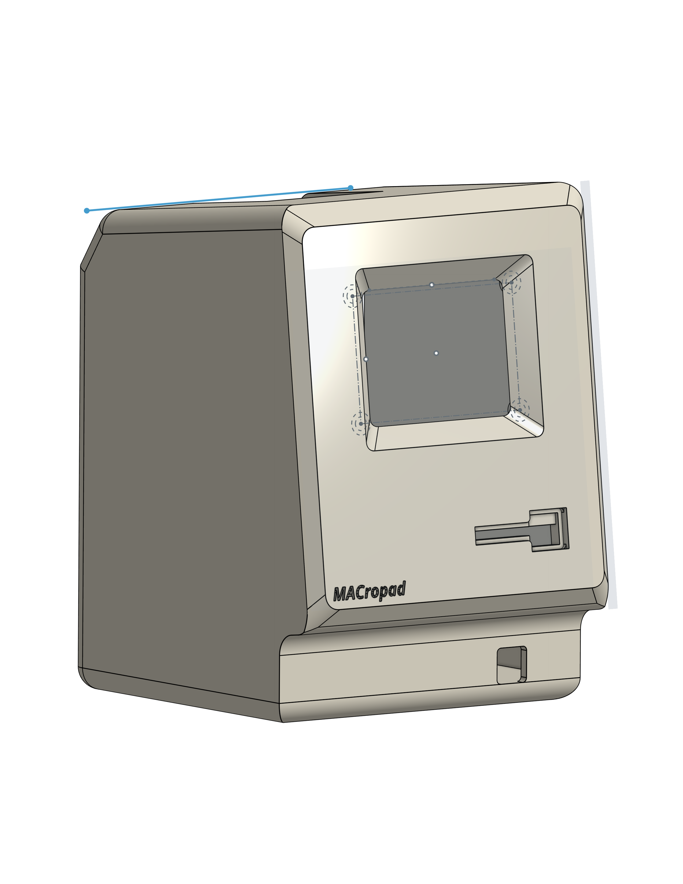

# MACropad
#### Open-Source Macropad, in form factor of the iconic Apple Computer Macintosh. 

### Functionality
---
- 6 Customizable Keys
- 2 Rotary Encoders
- RGB-powered Lights
- eInk Display

### Hardware
---
- Custom PCB, powered by the RPI Pico
- 3D Printed Case
- Headphone Jack UART Communication between MAC and Pad

### Software
---
- Embedded Rust

### Repo Structured as follows: 
```
MACropad
├── Firmware
│   ├── Cargo.toml
│   ├── Cargo.lock
│   ├── src
│   │   ├── main.rs
│   │   ├── lib.rs
│   │   ├── rotary.rs
│   │   ├── key.rs
│   │   ├── display.rs
│   │   ├── led.rs
│   │   ├── uart.rs
│   │   ├── usb.rs
│   │   ├── usb_desc.rs
│   │   ├── usb_strings.rs
├── ECAD
│   ├── MACropad.gerber
│   ├── MACropad.bom
├── MCAD
│   ├── case.step
│   ├── case.stl
│   ├── case.gcode
├── Images
│   ├── MACropad.png
├── LICENSE
├── README.md
├── .gitignore

```